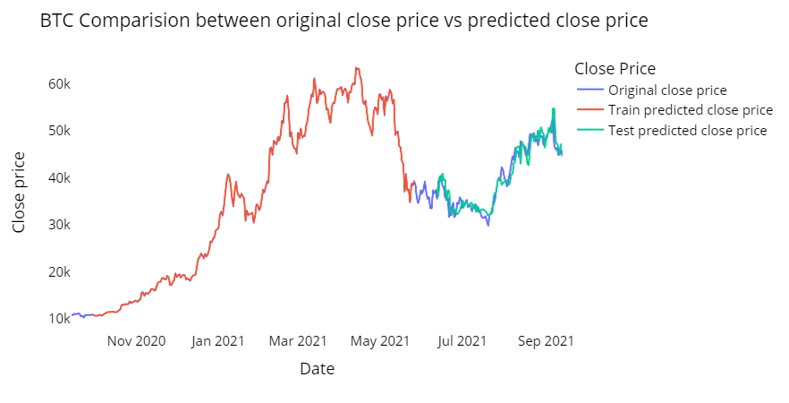
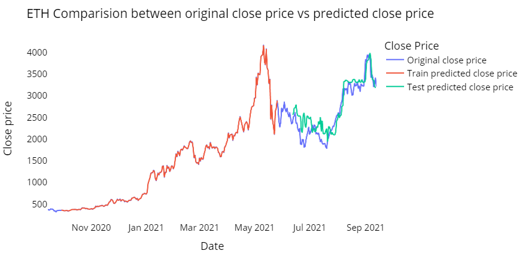
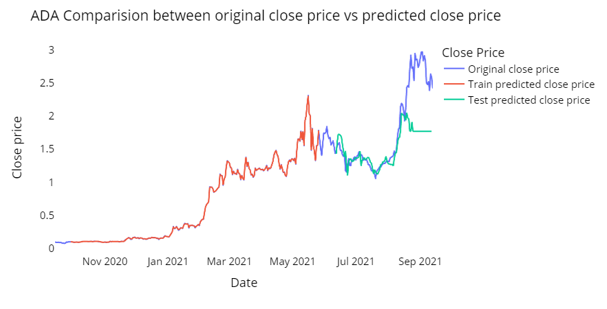

# Project Crypto Prediction Using XGBoost
Predict coin prices in the future using XGBoost algrithsm. 

### Link youtube: https://youtu.be/Tl2KNAh_lkQ

# Requirements
To run the code in this repository, you need the following dependencies:
Python 3.x
XGBoost
Pandas
NumPy
Scikit-learn


# Installation

### 1. Clone the repository:

```
git clone https://github.com/nguyenthuanit265/crypto-prediction.git
```

### 2. Navigate to the project directory
```
cd crypto-predict
```

### 3. Install the required dependencies
```
pip install -r requirements.txt
```

# Usage
Prepare your data in CSV format. Sample datasets for ADA, ETH and BTC are provided.

Run the Jupyter Notebook
```
jupyter notebook crypto-predict-XGBoot.ipynb
```

# Model Description
The model uses XGBoost, a powerful and scalable gradient boosting framework, to predict cryptocurrency prices. Key steps include:

1. Data Preprocessing: Cleaning and preparing the historical price data.
2. Feature Engineering: Creating new features from the existing data to improve model performance.
3. Model Training: Training the XGBoost model on the prepared dataset.
4. Evaluation: Assessing the model's performance using appropriate metrics.

# Results



